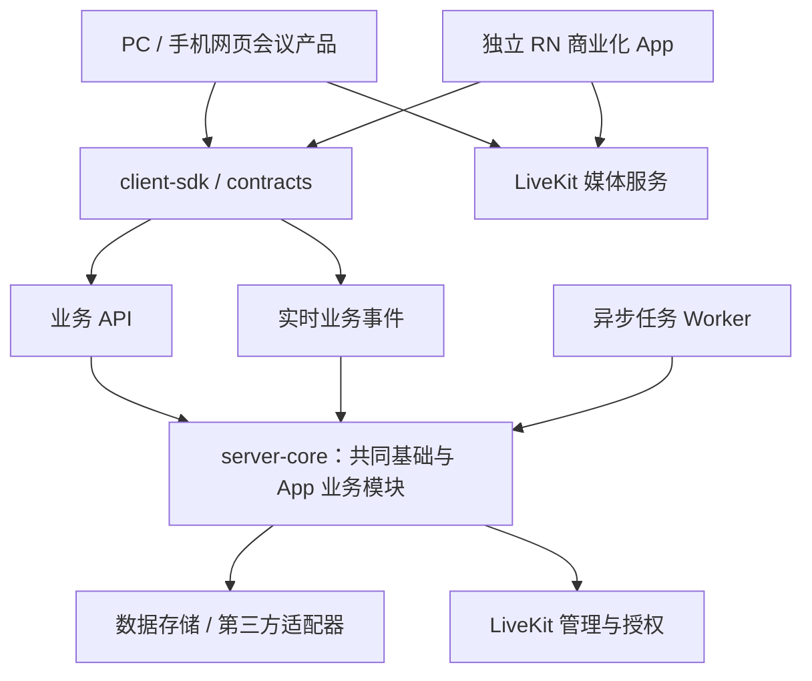

# VoceSpace 前后端分离、共享库与独立 App 规划

更新日期：2026-09-30。状态：规划，尚未实施。本次修订以“先拆分现有项目并建立统一库，再创建独立 React Native App”为实施顺序。商店流程沿用本次规划已核对的官方来源，实际提交前再次确认。

配套文档：[滑动预览与延迟加入 Space 技术方案](app_直播.md)。该文档的发现流属于 App 产品；其中现有代码路径是迁移前定位，后续接口归属以本文的独立后端为准，不要求 PC 实现滑动发现。

## 1. 产品定位与实施约束

### 1.1 PC 与 App 是两个独立产品入口

**PC / Web 保留现有会议与协作能力；App 面向商业化，独立发展发现、社交和运营业务。** 两端共享身份、Space 与媒体等基础服务，页面、导航、业务编排和发布节奏分别维护。

| 产品 | 定位与保留能力 | 演进方式 |
| --- | --- | --- |
| PC / Web | 当前会议、邀请、预加入、音视频、聊天、子房间、权限、文件、录制、AI、工作模式及其他现有能力 | 先保持用户可见行为，再通过 SDK 对接独立后端；不引入滑动切换作为必需流程 |
| 手机浏览器 Web | 保留当前适配及邀请链接访问能力 | 继续属于 Web 产品，不等同于原生 App |
| React Native App | 独立 iOS / Android 客户端，面向公开 Space 发现、预览、互动及商业化业务 | 新建项目与原生 UI，独立路由、会话管理和版本发布 |
| Web 管理后台 | 保留原有管理能力 | 后续增加 App 内容治理、订单/权益及运营管理模块，按权限隔离 |

App 不是将全部 PC 页面换成原生组件。已有会议能力作为可选择复用的服务能力，App 首发范围独立确定。PC 不需要导入发现流状态机、预览播放器或移动支付代码。

### 1.2 本轮架构决策

1. 先完成现有项目内部服务层抽取、统一契约与 SDK，再分离部署前后端；现有 Web 是统一 SDK 的第一个真实消费者。
2. Web 完成新后端切换并通过会议回归后，再创建正式 RN 项目并开发 App。可提前做一次性原生技术验证，但不让原生页面开发牵引前后端边界。
3. 推荐先使用 monorepo：独立应用、独立构建和发布，共享契约与库。是否后续拆成多个 Git 仓库，由团队和发布需要决定。
4. 后端采用模块化结构。API 与 Socket.IO 初期可以在一个进程运行；媒体任务按生命周期交给 worker。逻辑拆分不等于必须部署多个微服务。
5. 保留 PC 的部署选择和会议使用能力。App 新增商业化规则只作用于明确的产品/租户范围，不默认给现有会议流程增加付费、公开曝光或强制登录门槛。

### 1.3 App 范围

首个可测试版本先完成登录或受控访客身份、邀请、加入、通话、聊天和退出。其后加入公开发现、上下滑动预览、停留 10 秒自动以观众身份加入、举报/屏蔽、个人设置及适用的账户删除。

商业化是 App 的明确发展方向，但具体会员、付费 Space、礼物或其他交易模式需定稿。架构预留独立模块，按选定的商业闭环实施，不把所有候选商业模式同时纳入首发。

“类似全民 K 歌”当前确定的是房间发现交互；曲库、伴奏、歌词、合唱同步、打分等能力尚未确定。E2EE、屏幕共享、后台通话、AVO、Live2D、AI 和工作模式在 App 的支持范围分别验证；不因此删减 PC 现有实现。

## 2. 当前项目拆分范围

当前项目采用 Next.js、React、Ant Design、Zustand、LiveKit、Socket.IO 和自定义 `server.js`。已有 hook / 视图拆分可继续服务 Web，但没有完成独立前后端边界。

| 当前位置 | 需要处理的耦合 | 目标归属 |
| --- | --- | --- |
| `app/` 页面、`components/`、`features/*/views` | Next 路由、DOM、样式及 PC/Phone Web 渲染 | `apps/web`；保留 Web UI 和本地控制器 |
| `app/api/*` | HTTP 参数处理与业务、存储、第三方调用混合 | HTTP 适配进入 `services/api`，业务进入 `packages/server-core` |
| `server.js` | Next 启动、Socket 事件、Redis、定时任务混合 | 分离 Web 启动、业务服务启动与 worker；梳理共享状态归属 |
| `lib/api/*` | 同源 URL、浏览器全局对象和 API 调用耦合 | `packages/client-sdk`，显式注入 baseUrl 与认证 |
| `lib/std/index.ts`、`lib/std/space.ts` | DTO、纯规则、UI 类型、平台工具混合 | 分流到 contracts、domain、Web 工具或 server-core |
| `lib/store/*` | 业务状态、布局状态与媒体对象混合 | 端内 store 保留；只共享稳定数据模型和纯状态转换 |
| `lib/realtime/socket.ts` | 模块单例、默认同源、连接归属 | SDK 提供带认证的客户端工厂，各 App 拥有连接生命周期 |
| `components/Room/hooks/UseRoomConnection.ts` | Web Worker、hash、浏览器采集配置 | Web RTC adapter；App 后续实现自己的 Native adapter |
| `features/conference/hooks/*` | UI、媒体 SDK、权限与业务编排交织 | 纯规则按需提取；Web hook 保留，不整体迁往共享包 |
| `app/api/connection-details/route.ts` | 身份、权限和媒体令牌生成集中 | 后端认证/Space 授权/媒体授权服务；旧接口转调同一服务 |
| 配置、Redis、S3、AI、录制、平台集成 | 可能被前端或路由直接引用 | 后端适配器管理，向客户端提供脱敏能力配置 |

拆分期间记录每个 API / Socket 事件的调用者、鉴权、响应、存储、副作用和错误行为，避免只移动文件却保留跨边界导入。

## 3. 目标架构与统一库

### 3.1 目标目录

```text
apps/
  web/                       # 当前 Next.js Web 产品及管理页面
  mobile/                    # 后端拆分验收后，新建独立 RN 项目
services/
  api/                       # 独立业务 HTTP 服务与组合启动入口
  realtime/                  # Socket.IO 事件适配，可与 api 同进程部署
  worker/                    # 预览出口、异步任务、清理与对账
packages/
  contracts/                 # JSON DTO、运行时边界校验、事件、错误码
  client-sdk/                # HTTP / 实时客户端封装
  domain/                    # 跨端纯业务规则、消息去重、校验
  server-core/               # 仅后端：授权、业务服务、存储端口
  design-tokens/             # 可选：基础品牌颜色/间距等纯数据
```

这是目标结构。迁移前半程仍可保留根目录 Next.js，通过适配入口调用抽出的服务层；完成业务边界后再移动到 `apps/web`。迁移目录、升级框架和改写业务分开实施。



业务 API 负责身份与授权，音视频由客户端直接连接媒体服务。共享 API 服务不代理所有音视频流量。

### 3.2 每个库的边界

| 包 | 可以包含 | 不应包含 |
| --- | --- | --- |
| `contracts` | 可序列化 DTO、事件载荷、错误码、版本、边界校验 schema | DOM、React UI、数据库实体、密钥、第三方管理 SDK |
| `domain` | 可跨端使用的纯规则、消息去重、通用状态转换 | 网络/数据库副作用、浏览器全局对象、平台 UI |
| `client-sdk` | HTTP 请求、分页、取消、错误映射、认证注入、Socket 客户端工厂 | localStorage/window 默认访问、页面跳转、媒体采集、管理密钥 |
| `server-core` | 权威鉴权、Space 服务、存储端口、交易与权益服务、任务规则 | NextRequest/NextResponse、前端组件、客户端可导出的 secret |
| `design-tokens` | 按需共享的品牌基础值 | 强制两端相同布局、整套 Ant Design / RN 组件 |

依赖方向：`domain → contracts`；`client-sdk → contracts`；`server-core → contracts/domain`；各服务调用 server-core，各客户端调用 client-sdk。contracts 是独立底层包。客户端构建必须禁止依赖 server-core 及其传递依赖。

不追求共享全部 hook。每端的业务 hook 调用 SDK 和纯规则，承担自己的交互编排；App 专属发现状态机先放在 App feature，后续确有第二消费者时再独立成包。共享包默认不依赖 React，只有确需共享 hook 的新包才声明 React peer dependency。

数据库实体不能直接作为 API 响应类型。边界校验需要运行时执行，不能仅用 TypeScript 接口代替输入验证。

### 3.3 后端业务模块

| 模块组 | 内容 | 主要消费者 |
| --- | --- | --- |
| 共同基础 | 身份、会话、Space、成员、角色、邀请、聊天、文件、录制、媒体令牌 | Web 与 App |
| 会议扩展 | 工作模式、AI、子房间协作、现有平台集成与会议管理 | 首先保留 Web，App 按产品范围接入 |
| App 发现与社交 | 公开策略、feed、预览租约、推荐、关注、互动 | App；PC 不被要求提供对应界面 |
| App 内容与运营 | 举报、屏蔽、内容处置、运营配置、通知、统计 | App 与管理后台 |
| 商业化 | 商品、订单、商店交易、订阅、权益、退款/撤销、对账 | App 与管理后台；共享账号下的权益作用域明确 |

初期这些是同一后端中的模块，不要求独立服务或各自数据库。模块通过明确服务接口调用；Socket、worker 和 HTTP 入口复用同一授权规则，不能分别实现不同版本的权限逻辑。

## 4. 改造方案与迁移保护

### 4.1 从 Next API 抽出独立后端

1. 在现有仓库内提取业务服务。Next route 先只保留请求解析、会话上下文、调用服务和响应映射，行为保持兼容。
2. 定义 `/api/v1` 契约、统一错误 `{ code, message, requestId }`、分页、取消、幂等和认证语义；旧接口由兼容层转换参数和响应，调用相同服务。
3. Web 逐功能改用 client-sdk，先完成登录/入房/聊天，再迁移文件、录制、AI、管理等能力。不要在这一阶段同时重写会议交互。
4. 建立独立 TypeScript Node 业务服务，HTTP 框架在接口盘点后选定；可以沿用已有 Express 经验，不把更换框架作为拆分的前提。
5. 从 `server.js` 移出 Socket 处理和任务，统一注入配置、认证、存储和服务实例。独立服务不导入 Next 启动器或页面文件。
6. 服务切换完成后再移动 Web 目录、调整镜像/启动脚本/CI。最终核心业务不依赖 Next 服务运行，Next 只保留渲染和必要的前端适配。

### 4.2 网络、身份与实时连接

- Web 优先通过反向代理继续使用同站 `/api` 和 `/socket.io`，分别路由到独立后端，减少首轮跨域及 Cookie 行为变化；配置 WebSocket Upgrade、超时和上传大小。
- 确需跨域时明确允许的 Origin、credentials、Cookie Domain/SameSite/Secure、CSRF 防护和预检；不能用通配 CORS 代替认证。
- 保留当前会议用户可用的身份入口，修复服务端授权边界。App 使用独立的登录/刷新/退出及安全存储适配；昵称或客户端 identity 不作为可信授权依据。
- 统一 accountId、tenantId、spaceId、业务 sessionId 与 RTC participant identity 的映射。已有 Space 名称链接提供兼容解析，不要求用户更换邀请地址。
- 平台登录逐步改为一次性 code 换取会话；长期认证信息和 RTC token 不放进跳转 URL。
- Socket 连接按服务地址和登录会话创建；定义事件确认、重复消息、断线恢复、权限撤销、频道离开与退出清理。多副本部署时单独验证消息分发和共享状态。
- Web / App 的 RTC 连接均由端内会话管理器拥有；React 页面重渲染和布局变化不重建媒体连接。

### 4.3 数据、配置与任务归属

拆分前先盘点 Redis、配置文件、本地文件、对象存储、进程内状态和定时任务。首轮优先保留现有数据结构与唯一写入方，通过 repository / adapter 隔离，避免一边拆服务一边改全量数据模型。

商业化订单、交易流水和权益需要可靠的持久化与事务约束；选型阶段建议评估关系型数据库，Redis 主要承担缓存、租约、限流和任务协调。新增商业表通过独立迁移引入，不以缓存替代财务业务记录。

长时间预览出口、录制任务、清理和对账由 worker 管理；规定任务幂等、重试、取消、失败状态及重启恢复。切换部署时确保同一任务只有一个执行归属，不让新旧进程重复调度。

配置区分服务端 secret、客户端公开能力配置和实例/租户配置。LiveKit、S3、AI、邮件及管理密钥仅保留在服务端；清理现有敏感配置日志。给自建部署新增独立服务说明、健康检查、持久化和备份恢复路径。

### 4.4 PC 保持能力的验收与回退

迁移前为下列行为建立基线：创建/邀请/预加入、权限与角色、通话和设备切换、聊天、子房间、重连与退出、E2EE、共享屏幕、文件、录制、AI/工作模式、平台接入和管理后台。最终范围以当前功能清单为准，不以 App 首发能力替代。

每迁移一个业务模块，先通过契约和服务集成测试，再完成相关 Web 回归。开发/测试环境验证新后端后，按模块切换代理或客户端配置；禁止将创建 Space、支付、消息写入等请求直接双写到新旧服务做比较。

回退保留上一稳定服务与配置、数据库备份及旧契约。数据库采用先新增后清理的兼容迁移；不可逆写入和破坏性 schema 变更必须另有恢复方案。切换期间尽量保持现有 RTC 会话和 Socket 地址稳定，升级中断行为单独验证。

### 4.5 独立 RN 项目

完成前后端分离验收后，在 `apps/mobile` 创建 React Native 项目，独立 package 配置、导航、环境、应用标识、原生工程和 CI。通过版本化 contracts / client-sdk 对接服务，不导入 `apps/web` 的源码。

建议采用 Expo development build / prebuild + LiveKit RN SDK，真机 POC 后锁定 Expo / RN / React / LiveKit / WebRTC 兼容矩阵。LiveKit 需要原生模块，不能用 Expo Go 替代开发构建。[LiveKit Expo 指南](https://docs.livekit.io/transport/sdk-platforms/expo/)

App 自行实现 RTC、权限、安全凭证存储、生命周期、音频路由、导航和预览播放器适配。Web 与 Native 可使用各自兼容的依赖版本，不为新 App 强制升级现有 Web 框架。

原生房间先跑通登录—加入—通话—退出；之后接入滑动发现和预览。App 自动加入默认不开麦/摄像头，预览不连接正式 RTC Room；PC 原有显式预加入选择保持其产品语义。

商业化上线前按选定业务实现服务端订单状态、商店交易校验、回调幂等、订阅续期、退款/撤销及恢复购买。权益由后端判定并关联可信账号，不信任客户端“支付成功”或自行声明的会员等级。不同产品/租户的权益范围需要明确，不能影响未启用商业能力的 PC 实例。

## 5. 分阶段实施 Checklist 与验收门槛

先完成 B0–B3，再进入 B4 的正式 App 开发。具体工期在 B0 完成接口、数据和真实服务回归盘点后估算；商店账户验证、适用测试周期及审核等待另计。

| 阶段 | 目标 | 必须交付的验收结果 |
| --- | --- | --- |
| B0：现状与边界 | 盘点功能/API/事件/数据，确定两端产品范围 | PC 功能基线、依赖图、迁移顺序、接口清单 |
| B1：抽服务和统一库 | 当前项目内抽出 server-core、contracts、domain、client-sdk | 薄 Next route、明确包边界、Web 已通过 SDK 使用核心流程 |
| B2：独立后端与 Web 切换 | 拆出业务服务、Socket/worker，迁移全部 Web 业务调用 | 独立部署与健康检查、兼容接口、数据/任务归属清晰 |
| B3：稳定架构与 PC 验收 | 形成 apps/web + services + packages，完善部署和 CI | 完整 PC 回归、独立构建发布、升级与回退演练通过 |
| B4：新建原生 App | 原生基础工程和会议核心闭环 | iOS/Android 真机与 Web 互通，登录/权限/网络/退出正确 |
| B5：App 发现和运营 | 公开发现、预览、延迟加入、互动与内容治理 | 配套直播文档验收通过，PC 无发现流依赖 |
| B6：商业化闭环 | 按定稿模式实现商品/交易/权益/运营 | 商店沙盒、退款/续期/恢复与对账用例通过 |
| B7：商店发布 | 素材、隐私、签名、测试、审核、上线观察 | 两店审核通过、运维指标可用、故障降级可执行 |

### B0：盘点与架构定稿

- [ ] 梳理 PC/手机网页现有能力和真实服务回归基线。
- [ ] 列出所有 Next API、Socket 事件、外部平台调用和任务。
- [ ] 列出数据/配置/文件位置、写入方、事务与生命周期。
- [ ] 确认账号/租户/Space/媒体身份映射及旧链接兼容策略。
- [ ] 确认 monorepo、包边界、后端框架和模块切换顺序。

### B1：服务抽取与统一库

- [ ] contracts 定义 DTO、运行时校验、错误码和事件协议。
- [ ] server-core 抽取授权、Space、成员、媒体授权等服务，Next route 变薄。
- [ ] client-sdk 支持 baseUrl、认证注入、取消、错误映射和实时连接工厂。
- [ ] 提取实际可共享的纯规则，Web hook 与视图保留在 Web。
- [ ] Web 的登录—入房—聊天—退出先完成 SDK 接入和回归。
- [ ] CI 验证客户端不依赖 server-core，跨端包不依赖 DOM / Node 私有实现。

### B2：独立服务与迁移

- [ ] 独立 HTTP 服务可以脱离 Next 启动并完成核心业务。
- [ ] 拆出 Socket 事件适配和 worker，统一授权与任务幂等。
- [ ] 文件、录制、AI、平台集成、管理等剩余 Web 调用接入 SDK。
- [ ] 配置代理、Cookie/CORS/CSRF、WebSocket、上传和深链兼容。
- [ ] 保留旧 API 兼容层并禁止绕过统一授权。
- [ ] 核对存储、定时任务和媒体任务的唯一归属及故障恢复。

### B3：Web 稳定验收

- [ ] 完成目标目录迁移及 Web/服务/包的独立构建配置。
- [ ] 更新容器、安装说明、环境变量、健康检查和备份恢复操作。
- [ ] 完成 PC 与手机网页完整回归，保留既有会议能力。
- [ ] 完成服务升级、旧客户端兼容及回退演练。
- [ ] 确认正式 App 开发所需契约稳定，记录后续兼容策略。

### B4–B7：独立 App 与商业化

- [ ] B4：新建 RN 项目，确定原生依赖矩阵、权限与安全存储。
- [ ] B4：两端真机验证登录/邀请/媒体/蓝牙/弱网/前后台/退出。
- [ ] B5：按 app_直播.md 完成公开策略、媒体出口、10 秒加入和取消补偿。
- [ ] B5：完成举报、屏蔽、内容处置、账户删除和统计说明。
- [ ] B6：定稿商业模式、权益作用域及发行地区对应的支付路径。
- [ ] B6：完成服务端交易确认、幂等回调、退款/恢复/续期及后台对账。
- [ ] B7：完成商店测试包、素材、审核账号、政策声明及送审发布。

B5 的媒体服务验证可以在后端架构稳定后并行准备；商店主体和材料可提前准备。B6 是否属于首次公开版本，由产品范围决定；若首发包含付费，B6 是发布前必须通过的门槛，不能先上线再补订单与权益正确性。

## 6. Google Play 发布操作流程

### 6.1 账户与发布身份

1. 确定个人或组织主体，创建 Play Console 开发者账户；组织按控制台提供组织验证资料，避免先用临时个人账户发布再转移。
2. 完成身份、联系方式及控制台要求的设备验证。Google 当前收取一次性 25 美元注册费，支付方式和验证流程依地区/主体而异。[Play Console 注册指南](https://support.google.com/googleplay/android-developer/answer/6112435?hl=en)
3. 为应用确定长期使用的 `applicationId`，建立测试和生产环境。开启 Play App Signing，区分 app signing key 与 upload key，备份上传密钥，配置最小权限发布账号。

### 6.2 工程与测试包

1. 创建应用条目，设置语言、名称、应用类别、免费/付费属性和联系信息。
2. 配置 Android `versionCode` 递增，`versionName` 对应产品版本；生成 release AAB，不使用 debug APK 提审。
3. 截至核对日期，普通手机新应用/更新需 target Android 16 / API 36 或更高，自 2026-08-31 起适用；`minSdk` 另按依赖和支持范围确定，不能与 targetSdk 混淆。提交前再次查看控制台要求。[目标 API 要求](https://support.google.com/googleplay/android-developer/answer/11926878?hl=en)
4. 检查 RN / WebRTC 及所有 `.so` 的 16 KB page size 兼容性，在对应模拟器或设备验证；JS 测试通过不能证明原生库兼容。[Android 16 KB 指南](https://developer.android.com/guide/practices/page-sizes)
5. 首次将 AAB 上传到 Internal testing，完成安装、权限、播放、切换、退出和更新安装测试；查看预发布报告、崩溃、ANR 和设备兼容问题。

### 6.3 商店资料与政策声明

- 准备图标、feature graphic、手机截图、简短/完整介绍、客服和隐私政策 URL；截图来自真实 App，不用 Web 页面冒充。
- 在 App content 完成 Data safety、广告、目标受众、内容分级、审核访问方式及按实际使用触发的权限/前台服务声明。
- 隐私说明覆盖音视频、聊天、文件、账户、诊断、统计、录制、第三方处理者和保存期限；如存在后台敏感访问，按实际功能提供必要披露。[Google User Data](https://support.google.com/googleplay/android-developer/answer/10144311?hl=en)
- 若提供账户创建，提供 App 内删除入口和可在卸载 App 后访问的账户删除网页，并处理关联数据；在 Data safety 填写该入口。[账户删除要求](https://support.google.com/googleplay/android-developer/answer/13327111?hl=en)
- 直播/聊天属于 UGC：发布内容前接受使用条款，提供内容和用户举报、用户屏蔽及持续处置流程。[Google UGC 要求](https://support.google.com/googleplay/android-developer/answer/9876937?hl=en)
- 若归类为 Social 或落入儿童安全标准适用范围，准备公开的儿童安全标准、App 内反馈机制、内容处置流程和指定联系人；不能因为声明“仅限成人”就默认豁免。[儿童安全标准](https://support.google.com/googleplay/android-developer/answer/14747720?hl=en)
- 提供审核账号、可用公开演示 Space 和完整操作说明，保证审核期间服务可访问。

### 6.4 测试资格、送审与上线

对 **2023-11-13 之后创建的个人开发者账户**，目前要求至少 12 名测试者连续加入封闭测试至少 14 天，满足后申请 production access，并提交真实测试反馈和修复说明。该条件不能泛化到所有组织/历史账户，也不是“上传后等待 14 天”即可通过。[个人账户测试要求](https://support.google.com/googleplay/android-developer/answer/14151465?hl=en)

1. 在 Closed testing 配置测试人员、发布测试版本，收集并处理反馈；适用上述要求时完成资格申请。
2. 检查所有 App content 和资料任务已完成，创建 Production release，选择通过测试的 AAB，填写更新说明并送审。
3. 使用控制台支持的发布方式安排上线；首发的公开发布与后续更新的百分比 staged rollout 能力要区分，以控制台可用选项为准。
4. 审核通过后发布，观察入房成功率、崩溃、ANR、预览首帧和网络消耗；出现严重问题先关闭自动加入功能开关，停止后续分发，必要时提交修复包。[发布流程](https://support.google.com/googleplay/android-developer/answer/9859751?hl=en)

## 7. Apple App Store 发布操作流程

### 7.1 开发者账户与签名

1. 选择个人或组织 Apple Developer Program，准备 Apple Account、双重认证以及组织验证资料；组织通常需要 D‑U‑N‑S 和法人实体信息。
2. 完成会员注册；当前费用为每会员年 99 美元，实际本地金额及豁免以注册页面为准。[Apple Developer 注册](https://developer.apple.com/programs/enroll/)
3. 注册 Bundle ID，在 App Store Connect 新建 App；配置签名证书、provisioning profile 和实际需要的 capabilities。Universal Links、推送、后台音频、屏幕共享扩展按实现启用。
4. 发布凭证使用团队管理的证书或受限 App Store Connect API key，避免将个人账号密码放入 CI。

### 7.2 工程、隐私和审核能力

截至核对日期，Apple 要求上传包使用 Xcode 26 或更高、iOS 26 SDK 或更高；SDK 构建要求不代表最低支持系统也是 iOS 26。官方另要求自 2026-09-09 起上传 App 的 iOS deployment target 至少为 iOS 13；本项目最终下限取 RN/Expo/LiveKit 的实际兼容要求。年龄分级问卷也需使用当前版本。[Apple Upcoming Requirements](https://developer.apple.com/news/upcoming-requirements/)

- 设置版本与 build number，提供摄像头/麦克风等用途说明，审查第三方 SDK 的 Privacy Manifest 和 required reason API 声明。
- 填写 App Privacy、隐私政策、支持页面、内容分级和加密出口合规问卷；是否享有加密豁免需依据实际技术和发行情况判断。
- UGC 直播服务必须具备内容过滤/处置、举报、屏蔽和联系方式。产品应围绕可识别的主题 Space 和主持人治理，避免做成随机或匿名聊天匹配；Apple 指南明确限制这类用途。
- 提供账户创建时同时提供 App 内账户删除。采用第三方登录时评估指南 4.8 对等登录选项及适用例外；不要默认一律免于 Sign in with Apple 要求。
- 若以后销售数字会员/礼物，另行设计 StoreKit / Play Billing 和相应地区政策，不能直接将现有 Web Stripe 流程视为移动端合规实现。具体付费功能是否首发由商业范围定稿；包含付费时必须先完成 B6 的完整交易与权益验收。

上述审核规则参考 [App Review Guidelines](https://developer.apple.com/app-store/review/guidelines/)，需结合真实功能逐项填写，不能只改描述以规避实际行为。

### 7.3 TestFlight、送审与发布

1. 使用 Xcode Archive / Organizer、Transporter 或 EAS 上传签名构建，等待 App Store Connect 处理。
2. 在 TestFlight 配置测试信息，先内部测试，再按要求完成外部测试审核。验证真机、生产配置、权限拒绝、蓝牙、网络切换和预览流程。[TestFlight 概览](https://developer.apple.com/help/app-store-connect/test-a-beta-version/testflight-overview)
3. 在 App Store Connect 版本页填写名称/副标题/描述/关键词、截图、隐私和支持链接、版权、发行地区、价格及审核联系信息。
4. 提供审核账号、演示 Space；说明“上下滑动仅预览，停留 10 秒才自动加入，默认不开麦”，并提供举报/屏蔽/删除账户路径。服务在审核期间持续可用。
5. 选择已测试的 build，点击 **Add for Review**，再进入 submission 点击 **Submit for Review**；仅添加到 review 草稿并不等于送审。[Apple 提交步骤](https://developer.apple.com/help/app-store-connect/manage-submissions-to-app-review/submit-an-app)
6. 处理审核反馈；如改代码需上传更高 build number。批准后按手动或指定时间发布。后续更新可评估 phased release，首次发布另按控制台安排。

## 8. 构建、发布与运维交付

Web、业务服务、worker 和 App 分别构建发布。App 建议建立 development / preview / production 三套构建 profile。以下是后续配置好 EAS 项目后的操作示例，本次不执行：

```bash
eas build --platform android --profile production
eas build --platform ios --profile production
eas submit --platform android --profile production
eas submit --platform ios --profile production
```

EAS Submit 负责上传二进制，不替代商店元数据、测试资格和人工送审；Android 首次提交需按 EAS/Google 当前要求完成手动上传准备。[Expo 商店提交说明](https://docs.expo.dev/deploy/submit-to-app-stores/)

每个 release 归档 commit、锁文件、工具链版本、构建号、符号文件/source maps、测试记录和商店反馈。为 Web、App 和后端维护兼容矩阵与各自版本；服务端至少兼容上一稳定 App 版本，并根据真实旧客户端占比设定支持窗口。破坏性 API 变更先版本化再推广，共享库升级先检查所有受影响消费者。

CI 按应用和依赖包选择构建任务：共享契约变更验证 Web、App 与服务端；App 页面变更不强制重新发布 PC。每个客户端独立管理环境和依赖，后续若拆仓，统一库通过私有包注册表发布版本，避免依赖跨仓相对路径。

App 设置 `discoveryEnabled`、`previewEnabled`、`autoJoinEnabled` 功能开关，后端按产品/租户执行策略，不改变 PC 的默认会议入口；开关默认保守、请求失败沿用安全值。紧急关闭自动加入不影响已建立的正式会话。二进制已装到设备后不能假设一键回滚；准备兼容服务端和更高版本修复包。

统计沿用项目 Umami 规划的事件字典，通过原生适配层提交；不得记录令牌、房间密码、聊天正文或原始音视频。是否启用及需要何种同意按部署和隐私设置决定。

## 9. 开发启动时需定稿的决策

| 决策 | 本文建议默认值 | 对计划的影响 |
| --- | --- | --- |
| 发行主体/地区 | 正式运营主体；地区名单待定 | 商店验证、内容运营和当地材料 |
| 服务端选择 | App 首发建议官方运营服务；现有 PC 自建部署继续保留 | 两类部署的能力、认证及内容治理范围需明确 |
| 商业模式与权益 | 会员/付费 Space/礼物等需产品定稿，不默认全部首发 | 决定 B6 交易模型、商店配置与测试范围 |
| 仓库与发布 | 初期 monorepo，应用独立发布 | 后续拆仓时以版本化包分发统一库 |
| 自动加入身份 | 受控访客或登录观众；默认关闭采集 | 不因停留触发麦克风/摄像头权限弹窗 |
| 公开预览 | 主持人主动启用；旧 Space 默认关闭 | 防止历史私密内容意外进入发现流 |
| 首发媒体路径 | HLS 预览 + 正式 LiveKit RTC | 需要额外 Egress / 媒体网关 / CDN |
| 完整 K 歌能力 | 当前只确定发现交互，完整能力另行评估 | 曲库/合唱/音效独立评估，商业支付按 B6 定稿 |

B0 优先定稿前后端边界与 PC 兼容约束；B4 前定稿 App 技术范围；B6 前定稿商业模式和权益；商店开户及正式提交前确认发行主体、地区与材料。
