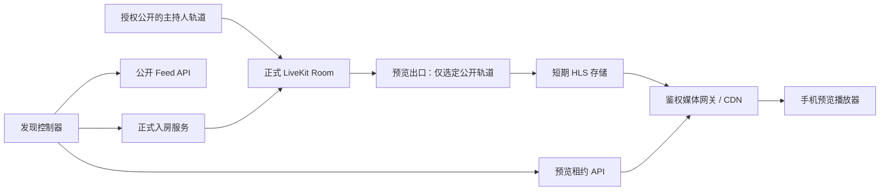
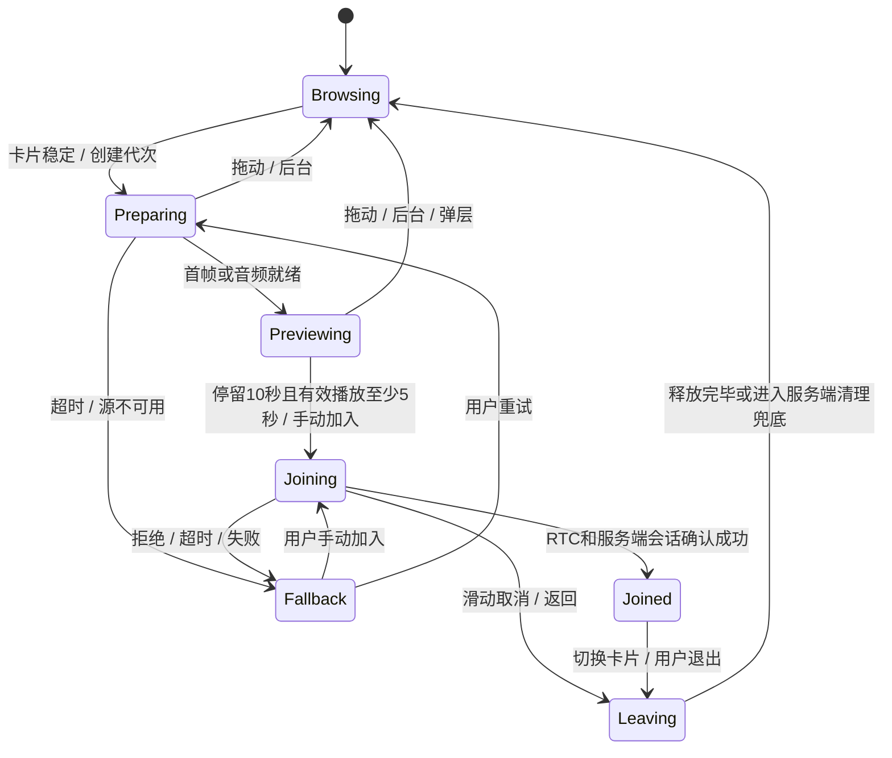

# VoceSpace 手机直播发现：上下滑动预览与 10 秒延迟加入

编写日期：2026-09-30。状态：技术设计，接口、字段、阈值和目录均为拟新增，尚未实现。迁移与发版总计划见 [app_plan.md](app_plan.md)。

## 1. 需求与行为约定

手机端提供全屏纵向 Space 列表。用户上下滑动选择 Space，卡片稳定后播放预览；预览期间不作为该 Space 的正式成员。连续停留 10 秒且满足预览和权限条件后，自动以观众身份加入。用户也可提前点击“立即加入”。

本方案借鉴房间发现交互，不推断全民 K 歌的内部实现，也不包含曲库、伴奏、合唱、送礼和打分系统。

### 1.1 “未加入”与“正式加入”的定义

| 状态 | 业务成员/在线人数 | 媒体连接 | 可执行行为 |
| --- | --- | --- | --- |
| 信息浏览 | 不写成员、不广播加入 | 封面/文字请求 | 滑动、查看公开信息 |
| 实时预览 | 不写成员、不拉私密聊天、不触发 AI/录制/在线统计 | 只读取独立公开预览流；用户不连接正式 RTC Room | 观看、静音切换、举报、立即加入 |
| 正式加入中 | 持有短期入房 reservation，尚未算成功 | 建立正式 RTC 连接 | 显示加入中，可取消 |
| 正式加入 | 经服务端确认的会话纳入成员、权限和统计 | LiveKit 正式 Room | 按角色聊天/举手；上麦或开摄像头需显式操作 |

预览播放次数与正式在线人数分别统计。媒体出口可能作为服务参与者连接原房间，但不能冒充真实观众计数。

### 1.2 时间规则

默认参数：卡片可见比例至少 90%，滚动停止稳定 300 ms 后认定 active，记为 `t0`；自动加入目标为 `t0 + 10,000 ms`。这些数值为本项目设计默认值，可通过版本化配置调整。

- 预览首帧/有效音频就绪后才算有效播放时间。目标是 5–10 秒的有效预览；正常网络下首帧越快，越接近 10 秒。
- 自动加入必须同时满足：该卡片连续 active 满 10 秒、有效预览至少 5 秒、前台可见、没有阻断交互、权限有效、自动加入未关闭。
- 首帧超过 3 秒仍未就绪，或播放卡顿导致到第 10 秒不足 5 秒有效预览，则本轮取消自动加入，显示重试/手动加入。不能看着加载页倒计时后悄悄入房，也不无限延长倒计时。
- 小于 1 秒的短暂缓冲不计入有效播放时间；超过 1 秒缓冲取消本轮自动加入。显式重试成功后重新建立完整倒计时。
- 手指开始拖动立即取消本轮倒计时；即使拖回原卡片，也重新稳定并从 10 秒开始。聊天/举报弹层、系统权限弹窗、App 进入后台、跳转其他页面同样取消；返回后重新计时。
- 倒计时最后一帧再次校验 active 的 Space、请求代次和状态，不能仅依赖一个 `setTimeout`。

卡片显示“预览中 · 停留 10 秒自动加入”，倒计时和“立即加入”可见；提供自动加入开关，关闭时持续预览但只能手动加入。预览默认静音，可点击听声音；不会因此打开麦克风。

## 2. 当前实现为什么不能直接复用为预览

1. `lib/api/space.ts::joinSpace()` 请求 `/api/connection-details` 获取正式令牌。该路由当前配置 `roomJoin/canPublish/canPublishData/canSubscribe`，不是预览凭证。
2. `components/Room/hooks/UseRoomConnection.ts` 创建正式 Room；现有用户选择可带媒体采集配置。预览不能挂载整个正式房间页面来隐藏 UI。
3. `features/conference/hooks/useConferenceInitialization.tsx` 在连接后拉取聊天、更新 `online/startAt/socketId`，进入子房间并广播状态，会产生正式入房副作用。
4. `ChildRoom.isPrivate` 描述 Space 内部子房间；不能据此判断 Space 是否可进入公共推荐池。`allowGuest` 也不等同于“同意公开直播”。
5. 现有 `/api/space` 承担多个业务动作。公开 feed 应新增最小 DTO，不直接向访客返回完整 `SpaceInfo` 或后台 `allSpaceInfos` 数据。

即使给 LiveKit 令牌设置 `canPublish: false` 或 `hidden: true`，观看者仍然建立 RTC 会话；这不能保证服务端计数、webhook 或连接成本不存在。Token TTL 也不等于到时强制断开已建立连接。[LiveKit token / grant 说明](https://docs.livekit.io/frontends/reference/tokens-grants/)

## 3. 媒体方案比较与推荐

| 方案 | 未正式加入的准确程度 | 体验 / 成本 | 结论 |
| --- | --- | --- | --- |
| 封面、人数、描述 | 满足不入房，但不是实时预览 | 成本低，无实时音视频 | 冷启动/失败降级，不能算实时预览验收通过 |
| 观众直接连正式 RTC，隐藏身份 | 不满足本方案的严格隔离 | 低延迟，但每次滑动建立 RTC、产生参与者 | 不作为默认实现 |
| 单独 preview RTC 房间，服务端中继选定轨道 | 不进入正式房间，但仍有预览 RTC 连接 | 延迟较低，需中继、授权、容量管理 | HLS 验证不达标后的候选路线 |
| 公开轨道输出 HLS，经媒体网关/CDN 播放 | 用户不连接正式 RTC，满足隔离 | 每个直播源有转码成本，观众通过 HTTP 分发 | 推荐首期路线，先验证首帧和直播延迟 |

推荐采用 **独立 HLS 预览 + 正式 LiveKit RTC**。LiveKit Egress 可输出 HLS segments 和 live playlist；自托管 Egress 需要另行部署，现有录制功能不代表已具备公开 HLS 预览。[Egress 输出](https://docs.livekit.io/transport/media/ingress-egress/egress/outputs/)、[自托管 Egress](https://docs.livekit.io/transport/self-hosting/egress/)

HLS 并不天然保证低延迟。先用热预览源和小分片实测首帧、直播延迟、耗电与兼容性；若不达目标，评估支持 LL-HLS 的完整媒体链路或独立 RTC 中继，不把设置 segment duration 当作 LL-HLS 已实现。

当前项目 server SDK 为 2.10.1，而最新 LiveKit 文档已包含新的 Egress API。POC 要锁定 LiveKit server / Egress / SDK 兼容矩阵，再选择该组合支持的调用；不得把最新版接口直接复制到旧 SDK。[Egress API](https://docs.livekit.io/reference/other/egress/api/)

### 3.1 媒体架构



出口只能包含明确授权的主持人视频/音频或专用公开舞台。禁止默认录制整个 Space 的所有轨道；屏幕共享、私密子房间、普通成员麦克风/摄像头默认不输出。

为防止自定义画面隐藏视频却仍混入私密音频，出口必须在轨道订阅/混音层按白名单处理。优先选择明确的音视频轨道组合；采用合成模板时，审计音频订阅和后端授权，不能只看最终画面。

### 3.2 出口生命周期

1. 主持人开启“公开发现并允许预览”，明确展示正在公开输出的轨道；记录同意时间、操作者、策略版本和源信息。
2. 后端以 `(spaceId, sourceVersion)` 建立唯一任务锁；预览出口由房间状态管理，一间 Space 同一公开源共用出口，不为每次滑动创建任务。
3. 出口就绪、通过健康检查后才将 `preview.status=ready` 写入 feed。冷启动或失败时展示封面，禁用本轮自动加入。
4. 源离线/房间关闭/策略收回时停止分发、吊销新请求资格、清理缓存索引；任务空闲按预算关闭。服务崩溃后用心跳、幂等任务表和对账清理孤儿出口。
5. HLS 分片使用私有存储、短期保留和过期清理；预览缓存不是默认开启的长期录制。已授权发出的缓冲片段无法从用户设备追溯撤回，应限制缓存窗口并明确这项边界。

## 4. 公开发现与权限模型

拟新增独立的发布策略，避免与子房间属性混用：

```ts
type SpaceDiscoveryPolicy = {
  visibility: 'unlisted' | 'public' | 'private';
  previewEnabled: boolean;
  autoJoinAllowed: boolean;
  source: { publisherId: string; videoTrackId?: string; audioTrackId?: string } | null;
  policyVersion: number;
  updatedAt: string;
};
```

旧 Space 迁移为 `unlisted + previewEnabled:false`。只有运营策略允许、主持人明确授权、源就绪且服务端可验证的 Space 才进入 feed。每次预览/加入均重新鉴权，不信任客户端缓存的 `canPreview`。

| Space 情况 | 发现/预览策略 | 自动加入 |
| --- | --- | --- |
| 已授权公开，允许当前身份访问 | 返回脱敏卡片和公开预览 | 允许，仍需加入时再次校验 |
| 私密、邀请/链接限定、受限租户 | 默认不进公共 feed，不签公开流 | 不允许绕过邀请/认证 |
| E2EE | 默认不公开预览，不给出口解密密钥 | 按独立的受邀加入流程 |
| 已封禁/被屏蔽/地区或年龄策略不符 | 服务端过滤并拒绝新租约 | 拒绝 |
| 房间满/许可证限制/已关闭 | 移除或标记不可加入 | 拒绝并显示明确原因 |
| 源未就绪/正在缓冲/无媒体 | 封面或“暂不可预览” | 本轮不自动加入 |

预览服务不能持有用户私密房间的全局读取能力。为公开源提供最小订阅权限；主持人切换到私密子房间时先撤销公开源，不得继续输出旧订阅。完整权限需要同时覆盖 RTC、HTTP 和 Socket，前端订阅过滤不是安全边界。

## 5. 拟新增服务接口

所有接口是新设计；沿用同一服务端授权层。JSON 使用稳定 `spaceId`，显示名称可变；跨实例数据加 `tenantId` / 服务地址作用域。请求携带服务器签发的登录或访客会话。

| 接口 | 输入/输出摘要 | 服务端约束 |
| --- | --- | --- |
| `GET /api/v1/discovery/spaces?cursor=...&limit=...` | 返回卡片、nextCursor、feedRevision | 只返已授权公开信息，限制页大小和请求频率 |
| `POST /api/v1/spaces/:id/preview-sessions` | 输入 policyVersion；返回 previewSessionId、playbackUrl、expiresAt、sourceVersion | 校验身份/源/封禁，签发短期播放资格；不创建正式成员 |
| `POST /api/v1/preview-sessions/:id/renew` | 返回续期租约和必要的新播放地址 | 仅当前前台 active 会话续期，每次重验策略；失败停止读取新媒体 |
| `DELETE /api/v1/preview-sessions/:id` | 释放当前预览租约，204 | 身份绑定、幂等；清理失败由租约到期兜底 |
| `POST /api/v1/spaces/:id/join-intents` | 输入 mode=`auto/manual`、previewSessionId、intentId、policyVersion；返回 reservationId、RTC URL/token、expiresAt | 服务端鉴权、容量预留、幂等；auto 必须满足服务端时间下限 |
| `POST /api/v1/join-intents/:id/confirm` | 客户端报告 RTC 已连接，返回正式 sessionId 或 pending | 以服务端观察到的连接、身份和 reservation 校验为准，不信任单独客户端声明 |
| `DELETE /api/v1/join-intents/:id` | 取消未完成加入 | 写取消墓碑，释放预留，处理迟到 RTC 连接 |
| `DELETE /api/v1/space-sessions/:id` | 正式退出 | 幂等关闭会话，撤销业务权限，必要时移除 RTC 参与者 |
| `PATCH /api/v1/spaces/:id/discovery-policy` | 主持人配置公开源和策略 | 检查 owner/管理权限、同意记录、源权限并递增策略版本 |

示例卡片（拟定）：

```json
{
  "id": "space_demo",
  "title": "夜间音乐交流",
  "coverUrl": "https://media.example.com/covers/demo.jpg",
  "host": { "displayName": "主持人", "avatarUrl": null },
  "memberCount": 24,
  "preview": { "status": "ready", "kind": "hls", "hasAudio": true },
  "join": { "allowed": true, "autoJoinAllowed": true },
  "policyVersion": 7
}
```

Feed 不返回完整成员身份、聊天历史、房间管理配置、RTC token、长期 HLS URL 或加密密钥。示例域名仅为占位。

### 5.1 播放凭证与缓存

预览租约初始可设 30 秒，媒体请求验证会话绑定、过期和策略版本；同一前台会话最多一个 active 预览租约。精确上限需压测后定稿。

关闭自动加入或入房失败后仍继续观看时，在租约到期前按服务端返回的续期时间调用 renew；续期不重置卡片的激活代次，也不能自动重试已取消的入房倒计时。后台、非 active 卡片和已释放播放器不得续期。

鉴权必须覆盖 master/media playlist、所有分片、加密 key（若使用）及重定向后的资源。只给 `.m3u8` 加签而把分片公开是不完整的。播放器是否能在子请求传递 header/cookie 要做真机验证；必要时由网关重写为逐资源短期签名 URL。

CDN 可在边缘鉴权后按源共享媒体缓存，但不得缓存跨用户的授权响应；日志移除 URL 签名和身份。源关闭时阻断新请求并尽快失效旧缓存，不能把客户端隐藏卡片作为撤销手段。

### 5.2 错误语义

`401 AUTH_REQUIRED`、`403 PREVIEW_DENIED/JOIN_DENIED/BANNED`、`404 SPACE_NOT_FOUND`、`409 SPACE_FULL/POLICY_CHANGED`、`410 PREVIEW_EXPIRED/SPACE_ENDED`、`429 RATE_LIMITED`、`503 PREVIEW_NOT_READY`。错误返回 requestId 便于诊断，不包含内部密钥或堆栈。

previewSession 创建时间只能作为服务端最低等待校验，不能证明用户真的观看。客户端统计的可见/播放时长用于体验和分析，不能作为支付、奖励或访问授权依据。手动加入不依赖完整预览时长，但必须执行同样的正式访问控制。

## 6. 客户端状态机与组件组织



建议将纯 reducer、计时条件和请求代次放入 `packages/domain/discovery`。Native 新增 `mobile/src/features/discovery/`；未来 Web 发现页通过自己的视图和播放器适配复用状态机。

```text
discovery/
  hooks/useDiscoveryFeed        # 分页、过滤、缓存、刷新
  hooks/useSpacePreview         # 租约、播放器事件、清理
  hooks/useAutoJoin             # 连续可见时长和条件判断
  hooks/useSpaceJoin            # intent、正式 RTC、确认、补偿
  session/DiscoveryCoordinator  # 唯一连接/播放归属与切换串行化
  views/DiscoveryScreen        # 全屏分页列表
  views/SpacePreviewCard       # 封面、预览、倒计时、操作
```

使用支持全屏 paging 的原生列表，按稳定 `spaceId` 作为 key。active 卡片由滚动结束位置、可见比例和当前页面前台状态共同确定，不能每次 `onScroll` 都发起连接。

只保持一个活动解码器；相邻卡片预取 DTO 和封面，首期不并行播放多个 HLS 源。大列表窗口化并回收播放器，安全区变化/屏幕旋转后重新计算页高，暂停原倒计时。

## 7. 竞态、正式加入与切换语义

### 7.1 异步取消

每次 active 卡片、会话或策略发生变化，递增 `generation`，取消 AbortController、计时器、播放器回调和本代租约。每个 await 后都检查 `generation + spaceId + foreground`。

取消 HTTP 请求并不表示服务端没有完成请求。迟到的 previewSession / join reservation 应主动释放；服务端通过 TTL、幂等键和取消墓碑完成兜底。用户滑过 A→B→C 时，迟到的 A 结果不能开始播放、计时或入房。

`join-intents/:id` 中的 id 使用客户端预先生成、服务端绑定身份的 intentId，因而创建响应尚未返回时也能取消。取消先于创建到达时保留墓碑，后到创建返回已取消；同一客户端会话的正式加入由服务端串行化，不能只依赖本地 single-flight。

定时器只负责唤醒。剩余时间使用单调时钟重新计算，并在 foreground/可见状态改变时取消，不通过不断减 1 模拟时间。JS 卡顿或系统暂停恢复后重新校验，不允许后台自动加入。

### 7.2 正式加入事务

1. 自动到期与“立即加入”都经过同一 single-flight 入口，生成当前激活周期唯一 `intentId`。同一请求重试使用相同幂等键，重新选择房间产生新 intent。
2. 服务端检查成员权限、封禁、公开策略版本、房间状态和容量；使用原子预留避免并发超限。返回短期、房间限定、身份绑定的观众 RTC token。
3. 客户端建立正式 RTC 时默认禁止媒体发布和数据发布，不调用现有预加入流程中的自动采集逻辑。pending token 建议暂不允许订阅；服务端确认资格后再开放对应轨道订阅权限，具体权限更新方式在 SDK POC 验证。预览可暂时保留画面，但在正式 RTC 音频启用前停止预览声音，避免双路回声。
4. RTC 连接成功后调用 confirm；服务端根据已验证 LiveKit webhook / 服务端查询与 reservation 关联，幂等激活业务会话，再执行成员初始化和加入通知。RTC 层在此之前可能已有一个 pending participant，不应提前记作完整业务加入。
5. 完成后释放 HLS 播放器和预览租约，开始正式会话时长。一次加入只能触发一次通知和一次统计。
6. 若连接、确认或初始化失败，释放 reservation、断开 RTC、清理局部 store；显示错误，允许重新发起。不能保留“已加入”的假状态。

观众上麦通过单独授权命令，由服务端检查角色/邀请并更新发布权限；只有用户明确操作且系统采集授权成功后才创建本地轨道。普通聊天若走业务 API/Socket 按正式会话授权，不为预览开放私密数据。

### 7.3 已加入后的上下滑动

- 对普通观众：开始拖动即静音当前播放并停止本轮自动动作；新卡片稳定后串行退出旧 Space，再开始新卡片预览。新 Space 仍需独立停留 10 秒，不直接跳房。
- 若拖动取消回到原卡片，尚未正式切换时保持旧正式会话；不重复广播加入。此规则与“预览状态拖动后重新计时”分开实现。
- 退出包括释放音视频轨道、撤销业务会话、解绑 Socket 频道、清除旧房间聊天/状态；不能只切换路由。
- 正在主持、上麦、屏幕共享或执行录制管理时，禁止无提示滑走；明确显示“停止当前操作并离开”确认，或者锁定发现手势。主持权移交/结束 Space 按现有业务约束执行。
- 本地媒体停止必须立即完成；服务端退出失败由租约、重试及 LiveKit 连接状态对账兜底。在旧正式会话的退出/撤销未确认前，允许看新预览但不建立新正式会话，避免同时加入两间。
- 加入请求发出后发生滑动，即取消 intent；若旧 token 已发出，服务端需要对迟到连接检测并移除，不能依赖 JWT 过期立即踢人。

## 8. 与现有业务集成

| 当前模块 | 计划改动 |
| --- | --- |
| `app/api/connection-details/route.ts` | 抽出可复用入房授权；区分观众/发言者 grant，旧入口也受约束 |
| `app/api/space/route.ts` | 抽取发现策略、正式会话和权限服务；新 feed 不复用后台全量响应 |
| `lib/std/space.ts` | 增加 Space 级公开配置和迁移默认值，保留子房间语义 |
| `components/Room/hooks/UseRoomConnection.ts` | 经 RTC adapter 接入；公开发现自动加入禁用已有媒体采集偏好 |
| `features/conference/hooks/useConferenceInitialization.tsx` | 成为确认正式会话后的幂等初始化，不被预览组件调用 |
| `features/conference/hooks/useConferenceMembership.tsx` | 区分正式会话与系统出口，避免预览污染成员/在线统计 |
| `lib/realtime/socket.ts`、`server.js` | 会话鉴权、频道退出、事件幂等与权限撤销，增加源状态通知 |
| Native 发现模块 | 新建列表、播放器、计时和协调器，不把每张卡片写成完整 Room 页面 |
| 管理后台 | 新增公开预览开关、源选择、审核/举报处置和媒体任务健康状态 |
| 部署配置 | 增加 Egress、媒体鉴权网关、私有对象存储/CDN、任务队列和清理策略 |

Egress/媒体任务不直接启动于 Next.js 请求处理函数中长时间运行；API 写入任务状态，由独立 worker 管理。使用 Redis 锁/租约时同时保留可恢复的任务记录，服务重启进行对账。

## 9. 指标、容量与成本

### 9.1 事件口径

拟定事件：`space_card_visible`、`space_preview_requested`、`space_preview_ready`、`space_preview_failed`、`space_preview_cancelled`、`space_auto_join_triggered`、`space_join_succeeded`、`space_join_failed`、`space_left`。

事件包含随机会话 ID、激活周期 ID、平台/版本、触发方式、错误类别、耗时；Space 标识按部署隐私策略处理，不上传令牌、房间密码、昵称或内容。Umami 仅承担产品分析，不负责授权和正式在线人数。

曝光按可见周期统计；`preview_ready` 按首帧/有效音频算成功；正式加入只在服务端确认后记成功，重试沿用 intentId 去重。分别看预览到加入漏斗、主动取消、失败和后台中断，不能把所有划走当故障。

### 9.2 初始验收目标（待 POC 与压测验证）

| 指标 | 目标 / 场景 |
| --- | --- |
| 预览首帧 | 热源、稳定 Wi‑Fi/4G，p95 ≤ 2 秒；超过 3 秒取消本轮自动加入 |
| 预览有效播放 | 正常路径 5–10 秒；不足 5 秒不得自动入房 |
| 提交时机 | 稳定 active 后绝不早于 10 秒，前台正常调度目标 10–10.5 秒 |
| RTC 正式连接 | 健康服务/稳定网络目标 p95 ≤ 3 秒，连接中明确展示状态 |
| 直播延迟 | HLS 热源先以 p95 ≤ 5 秒作为 POC 目标；超出则优化或改媒体路线 |
| 资源 | 一个活动预览解码器，最多一个正式会话；连续切换 100 次无单调资源泄漏 |
| 正确性 | 自动加入零重复通知；私密/E2EE 预览零泄露；切换无旧房间串音 |

这些是验收门槛建议，不是现有系统已达到的性能。冷源、不同运营商、低端设备和跨地区链路分别记录。

容量估算：单路 0.5 Mbps 的预览播放 10 秒约 0.625 MB，连续浏览一小时约 225 MB（十进制，不含协议、预取和重试）。1000 个同时观看者约 500 Mbps 下行流量；实际成本按 CDN 单价、峰值和缓存命中计算，不以 RTC 连接数代替带宽估算。

转码成本主要随同时启用的 Space 公开源数量增长，分发成本随观看量增长。音频房可采用音频流+封面，省流模式下低码率且禁止相邻媒体预取。是否在无人观看时保温出口应结合首帧目标和预算决定。

## 10. 测试与验收矩阵

| 类别 | 必测场景 | 通过标准 |
| --- | --- | --- |
| 时间 | 9.9 秒滑走、10 秒边界拖动、点击与到期同时发生 | 不早入、无重复 intent/成员/通知 |
| 加载 | 首帧慢、无源、只有封面、间歇缓冲 | 本轮取消自动加入并可手动操作 |
| 可见性 | 前后台、锁屏、系统弹窗、举报弹层、旋转 | 倒计时取消；返回重新计时，无后台加入 |
| 快速滑动 | A→B→C，A 的 token/首帧迟到；A→B→A | 只对当前代次生效，旧租约释放 |
| 加入事务 | 请求中取消、RTC 成功 confirm 超时、webhook 乱序重复 | 幂等确认/补偿，pending 会话可回收 |
| 身份/权限 | 被踢后重试、源转私密、封禁、房间满、过期邀请 | 服务端拒绝，旧 URL 无法持续读取新分片 |
| 私密媒体 | 子房间切换、普通成员发言、共享屏幕、E2EE | 出口只含授权轨道，声音与画面都不泄露 |
| 旧 API | 绕过 feed 直接请求原 connection-details / Socket 频道 | 仍受服务端同一访问策略约束 |
| 切换正式房间 | 观众滑走、主持人滑走、上麦/录屏时操作 | 普通观众可退出；关键操作有保护；无双房间会话 |
| 设备 | iOS/Android 真机、扬声器/耳机/蓝牙、来电中断 | 无双路音频，不擅自恢复采集 |
| 网络 | Wi‑Fi↔蜂窝、断网、TURN、弱网、CDN 失败 | 可重试、有明确状态、无孤儿成员 |
| 媒体鉴权 | playlist/segment/key 单独请求、缓存、重定向、过期 | 所有资源受约束，敏感 URL 不进日志 |
| 压力 | 多人并发自动加入、100 次滑动、出口进程重启 | 容量原子控制，无重复出口和持续资源增长 |
| 内容治理 | 预览中举报、屏蔽、源下架、运营处置 | 可操作且影响后续 feed/播放资格 |

单元测试覆盖纯状态机、单调时钟和竞态；契约/集成测试覆盖鉴权、幂等、容量和取消；真机端到端与压测覆盖媒体、系统生命周期和成本。当前 Web 的测试通过不能替代这些新增验证。

## 11. 实施顺序与交付门槛

- [ ] L0：锁定时间语义、公开授权范围、受控访客身份、退出规则和产品文案。
- [ ] L1：完成 RN 播放器 + Egress 热源 POC，验证首帧/延迟/原生 SDK 兼容矩阵。
- [ ] L2：完成发现策略、最小 feed、媒体出口和全链路媒体鉴权。
- [ ] L3：实现预览状态机、取消/回收、降级和无障碍操作；此时仍不开放自动加入。
- [ ] L4：实现正式入房 reservation / confirm / cancel、观众权限及旧 API 兼容鉴权。
- [ ] L5：串接 10 秒自动加入、已加入滑动退出、主持/上麦保护和指标。
- [ ] L6：完成真机、权限、媒体泄露、竞态和容量验收，再开放小范围测试。

投放开关按 `discoveryEnabled → previewEnabled → autoJoinEnabled` 分层。先验证可发现，再验证媒体，最后开放自动加入。发现流可对指定公开 Space 和测试人群开放，所有开关服务端参与判断。

若 HLS POC 不达标，L1 产出对比结果并切换独立 RTC 预览方案；不得以封面卡片或隐藏正式成员替代实时预览验收。上线前保留手动加入模式作为可用降级路径。
