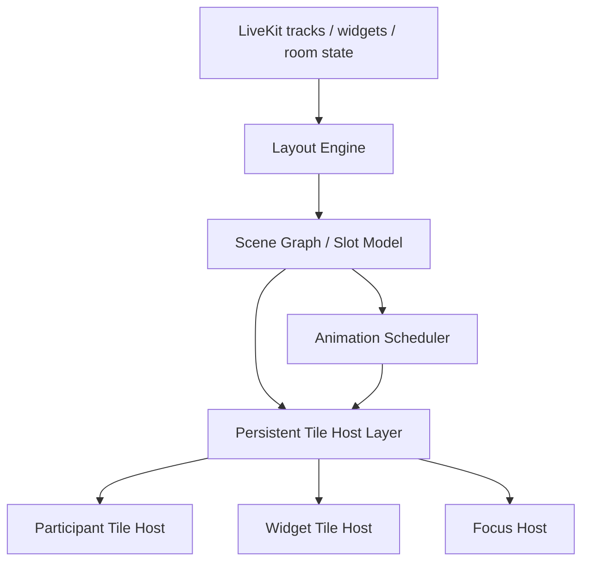

# Vocespace 布局系统重构说明

## 1. 背景

当前 Vocespace 的视频布局基于 LiveKit 现成的布局思路进行重写，已经在样式和交互上做了一层增强，但布局切换的核心仍然是 React 组件树分支切换。

从当前实现看，布局切换主要发生在以下几个位置：

- `app/pages/controls/video_container.tsx`
- `app/pages/layout/grid.tsx`
- `app/pages/layout/carousel.tsx`

尤其是在 `video_container.tsx` 中，`!focusTrack` 与 `focusTrack` 分支直接切换 Grid / Focus / Carousel 结构。这样做有一个根本问题：

1. 布局切换时，不只是位置变了，而是组件归属变了。
2. `ParticipantItem`、`TrackLoop`、`TilePlayer` 等节点会经历卸载和重新挂载。
3. 即使使用 `memo`、`useMemo`、协商缓存或稳定排序，也只能减少普通 render，不能避免 mount / unmount。
4. Focus Tile 被单独“拉出来”渲染时，主显示区和列表区之间的迁移本质上仍是节点迁移，不是视觉迁移。

这就是当前切换布局时仍然出现“回退感”、播放器闪动、状态重建、过渡不连续的根因。

另外，`app/pages/layout/carousel.tsx` 中还存在与方向相关的 `key={carouselOrientation}`。这会在横竖切换时强制 remount，进一步放大布局切换成本。

## 2. 当前问题的本质

当前系统的问题，不是“布局算法不够复杂”，而是“布局和渲染宿主耦合在一起”。

换句话说，现在的布局系统同时承担了两件事：

1. 决定每个 Tile 应该出现在哪里。
2. 决定每个 Tile 应该由哪个 React 分支来创建。

一旦这两件事绑在一起，任何布局切换都会变成 React 树切换。对于实时音视频场景，这种切换代价很高，因为 Tile 内部通常还包含：

- 视频流元素
- 音量、说话状态、网络状态
- 屏幕共享状态
- AI / Widget / 文档 / iframe 等扩展播放器
- 拖拽、聚焦、全屏、Pin 等交互状态

这些节点最怕的不是普通重新计算，而是生命周期重置。

## 3. 重构目标

这次重构的目标不是简单“换一种布局组件”，而是把布局系统从“条件渲染驱动”改成“稳定宿主 + 视觉编排驱动”。

核心目标如下：

1. Tile 节点尽量常驻，不因为布局切换而卸载。
2. 布局切换只改位置、尺寸、层级、透明度，不改组件树归属。
3. Focus / Grid / Carousel / Widget 混合布局统一由一个布局引擎输出 slot 结果。
4. 动画基于 `transform`、`opacity`、`z-index`、`clip-path` 等视觉属性完成。
5. React 负责数据和状态，布局引擎负责场景编排，渲染宿主负责稳定承载。

## 4. 为什么考虑 Canvas

你提出的方向是对的：如果目标是“切换布局时只移动，不重建”，就必须引入更偏场景图的思路。Canvas 是一个合理启发，因为它天然强调：

- 一个稳定的渲染平面
- 元素位置由坐标系统决定
- 布局切换等价于节点坐标变化
- 动画由插值驱动，而不是由组件树重排驱动

但是对于 Vocespace 这样的实时会议系统，不能简单理解为“把视频内容都画进 Canvas”。

原因是：

1. WebRTC 视频本身更适合由原生 `video` 元素承载。
2. iframe、Google Doc、嵌入浏览器、Hyperbeam、Live2D 等内容并不适合被真正 rasterize 到单一 Canvas。
3. 命中测试、文本选择、输入框、无障碍、浏览器层合成、清晰度缩放，都更适合保留 DOM 宿主。

所以更准确的方向不是“纯 Canvas 渲染布局”，而是：

## 5. 推荐方向：Canvas 思维 + DOM 宿主

推荐采用一种“Canvas 化布局，但 DOM 承载真实内容”的架构。

即：

- 用统一布局引擎计算所有 Tile 的目标矩形和层级。
- 用一个持久化的 Tile Host Layer 承载所有参与者 Tile / Widget Tile。
- 每个 Tile 保持稳定 key 和稳定宿主节点。
- 布局切换时只更新每个宿主节点的 `transform`、`width`、`height`、`opacity`、`pointer-events`。

这比纯 DOM 条件渲染更接近 Canvas 的组织方式，也比真正纯 Canvas 更适合你当前项目。

可以理解为：

- Canvas 提供的是“思维模型”
- DOM / video / iframe 提供的是“实际承载层”

## 6. 建议的目标架构



### 6.1 Layout Engine

布局引擎不再返回“渲染哪种 React 组件”，而是返回一份场景描述：

```ts
type LayoutNode = {
  id: string;
  kind: 'participant' | 'widget' | 'screen-share' | 'placeholder';
  x: number;
  y: number;
  width: number;
  height: number;
  zIndex: number;
  opacity: number;
  visible: boolean;
  area: 'main' | 'rail' | 'grid' | 'overlay';
};
```

这层只关心：

- 容器尺寸
- 当前模式（grid / focus / carousel / fullscreen / mixed）
- tracks / widgets 集合
- pin / focus / page / active-speaker / mobile 状态

它不直接创建 React 节点。

### 6.2 Persistent Tile Host Layer

建立一个固定存在的宿主层，例如：

- `LayoutStage`
- `TileHostLayer`
- `TileHost`

所有 `ParticipantItem` 和 `TilePlayer` 都在这里注册并常驻。每个 Tile 只初始化一次，然后长期存在。

布局切换时：

- 不再把 `ParticipantItem` 从 Grid 分支挪到 Focus 分支
- 不再让 `TilePlayer` 作为不同布局分支中的条件节点出现
- 不再通过 `if/else` 决定谁被创建，改为通过 slot 决定谁显示在哪

### 6.3 Scene Graph / Slot Model

建议将每个布局都转成统一 slot：

- `main`
- `secondary`
- `rail`
- `overlay`
- `hidden`

例如：

- Grid 布局：所有人都在 `grid`
- Focus 布局：focusTile 在 `main`，其余人在 `rail`
- TilePlayer Focus：focused player 在 `main`，participant rail 在 `rail`
- Fullscreen：主节点在 `main`，其余节点 `hidden` 或 `overlay`

这样布局模式只是 slot 分配策略不同，而不是渲染树不同。

### 6.4 Animation Scheduler

切换布局时，不立即切 DOM 结构，而是：

1. 计算旧布局快照。
2. 计算新布局快照。
3. 对每个 Tile 做 FLIP 或类似的 transform 过渡。
4. 在过渡完成后更新最终静态样式。

建议使用：

- `transform: translate3d(...) scale(...)`
- `transform-origin`
- `opacity`
- `transition` 或 `requestAnimationFrame`
- 必要时使用 Web Animations API

如果动画复杂度继续提升，再考虑引入专门动画层。

## 7. 这和 pretext 类项目有什么关系

如果你说的 pretext，是最近那类“把界面视为统一舞台，再让内容块在舞台中编排和过渡”的项目，那么它的确有启发意义，但更适合作为“设计思路”参考，而不是直接照搬。

可以借鉴的点：

1. 持久化舞台。所有内容都在一个稳定场景里移动，而不是在多个页面区域之间反复创建销毁。
2. 布局数据化。布局结果应先变成数据，再由渲染层解释执行。
3. 动画统一调度。过渡不应散落在各个组件局部，而要由布局层统一计算。
4. 视觉切换优先。用户感知的是“卡片移动”而不是“组件被换掉”。

不适合直接照搬的点：

1. Vocespace 有实时音视频轨道，不只是普通内容块。
2. 你有 iframe、文档、嵌入浏览器、假 Tile 等富交互对象。
3. 会议系统对输入、焦点、全屏、媒体播放控制的要求远高于普通展示型场景。
4. LiveKit 的 track 生命周期、订阅状态、占位轨道与普通 UI block 不一样。

结论是：

可以学习它的场景组织方式，但渲染承载层要保留适合 WebRTC 的 DOM / video 模型。

## 8. 技术建议

### 8.1 第一优先级：先拆出布局引擎

先不要急着把所有 Tile 改成 Canvas 风格移动，第一步应当把布局计算从组件树中拆出来。

建议新增一个纯函数层，例如：

- `computeLayoutScene()`
- `buildLayoutNodes()`
- `resolveLayoutSlots()`

输入：

- tracks
- widgets / players
- focusTrack
- fullscreen 状态
- 容器宽高
- 设备类型
- 分页状态

输出：

- 一组稳定的 layout nodes

只要这一步做成了，后面无论是 DOM transform 方案还是更激进的 Canvas 舞台方案，都有落点。

### 8.2 第二优先级：做稳定宿主层

把现有：

- `GLayout2`
- `CLayout`
- `FocusLayoutContainer` 中的条件渲染逻辑

收敛成一个稳定层，例如：

- `UnifiedLayoutStage`

该组件只负责：

1. 渲染固定数量或按需缓存的 Tile Host。
2. 将 scene node 映射到 host 样式。
3. 决定 `visible`、`pointer-events`、`z-index`、`transform`。

### 8.3 第三优先级：把 TilePlayer 独立成常驻宿主

这点很关键。当前你的设计文档里已经提到，TilePlayer 不应该再作为 layout 分支里的条件节点，而应该成为常驻宿主层中的一类节点。

建议直接把：

- participant tile
- image tile
- iframe tile
- embedded browser tile
- google doc tile

统一抽象为 `RenderableTile`。

差异只体现在内容渲染器，不体现在布局系统。

### 8.4 第四优先级：补动画与降级策略

建议提供三档运行策略：

1. `static`：只更新最终位置，不做过渡。
2. `transition`：CSS transform 过渡。
3. `animated`：FLIP / WAAPI / raf 插值。

这样可以根据设备性能降级，避免低端设备因为复杂动画掉帧。

## 9. 可行性评估

### 9.1 结论

可行，而且值得做，但建议分阶段推进，不建议一次性把全部布局逻辑改写成“纯 Canvas 引擎”。

### 9.2 为什么可行

1. 你当前的布局问题非常明确，根因已经定位到组件树切换，不是模糊问题。
2. 现有系统已经有 `tracks`、`focusTrack`、`carouselTracks`、`players` 等输入，具备抽象成场景层的数据基础。
3. 现有 UI 结构已经天然区分了主区、侧栏、播放器区，适合进一步抽象为 slot 模型。
4. React 18 + Next 14 + LiveKit 组合完全可以支撑“稳定 DOM 宿主 + transform 编排”的方案。

### 9.3 为什么不能一步到位做纯 Canvas

1. 视频、iframe、文档、输入交互并不适合完全扁平化到单一 Canvas。
2. 真正纯 Canvas 会明显增加交互、清晰度、无障碍和调试成本。
3. 一次性替换风险过高，排查问题会很困难。

因此更合理的结论是：

先做“Canvas 思维重构”，不必追求“纯 Canvas 承载”。

## 10. 预期收益

完成重构后，理论上可以获得以下收益：

1. 布局切换不再触发主要 Tile 的卸载挂载。
2. Focus / Grid / Carousel 切换更平滑，视觉上更像“移动到位”。
3. TilePlayer 与 ParticipantTile 可统一进入同一布局系统。
4. 后续新增布局模式时，只需要新增布局策略，不需要再复制渲染分支。
5. 动画、分页、Pin、全屏、混合 widget 的组合复杂度明显下降。

## 11. 风险点

需要提前注意以下风险：

1. 持久化宿主会增加状态同步复杂度，尤其是隐藏节点的事件响应和资源释放。
2. 如果常驻 Tile 太多，需要考虑虚拟化、分页缓存和非可见节点降载。
3. 部分第三方嵌入内容在 transform 缩放时可能出现清晰度或交互边界问题。
4. 全屏、画中画、浏览器媒体策略、pointer capture 可能与宿主层重构产生新的边缘问题。
5. 如果动画调度写在 React render 周期里，仍然可能卡顿，因此动画层最好尽量贴近 DOM 写入。

## 12. 推荐实施步骤

建议按四期推进：

### Phase 1：建模

目标：把布局从 JSX 分支中抽离。

输出：

- `layout scene` 数据结构
- `computeLayoutScene()`
- 当前 grid / focus / carousel 的统一输出协议

### Phase 2：稳定宿主层

目标：让 Tile 常驻，不再因为布局切换重建。

输出：

- `UnifiedLayoutStage`
- `TileHost` / `WidgetHost`
- 统一 key 和 host 注册机制

### Phase 3：动画层

目标：实现真正的“切换即移动”。

输出：

- transform 驱动的布局切换
- FLIP 或 WAAPI 过渡
- 低性能设备降级策略

### Phase 4：高级特性整合

目标：把 widget、doc、Hyperbeam、假 Tile、全屏等全部纳入统一布局引擎。

输出：

- RenderableTile 统一模型
- 可扩展 slot 策略
- 多内容类型一致过渡

## 13. 最终建议

最终建议是：

1. 方向上，继续推进这次重构，判断是正确的。
2. 实现上，不建议追求“所有内容都进 Canvas”，而建议采用“Canvas 思维 + 持久化 DOM 宿主 + transform 编排”。
3. 工程上，第一步先把布局结果数据化，再做宿主层稳定化，最后做动画，不要反过来。
4. 参考上，可以从 pretext 这类项目学习场景编排思路，但不要直接移植其渲染模式。

如果这次重构做对了，Vocespace 的布局系统会从“React 条件布局”升级为“场景编排布局”，这会是后续 widget 化、混合媒体化、空间化交互的基础设施。